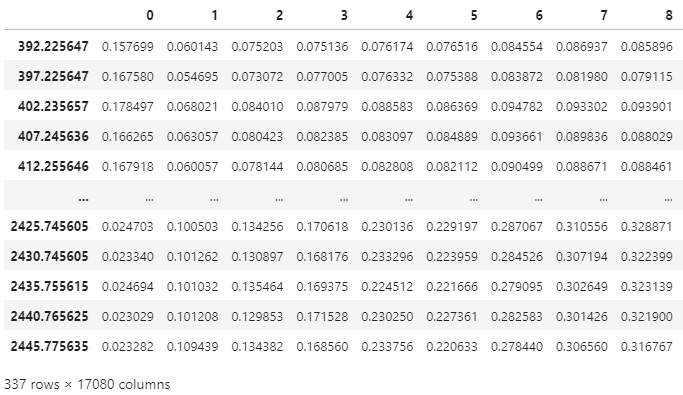
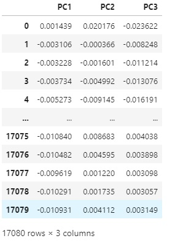
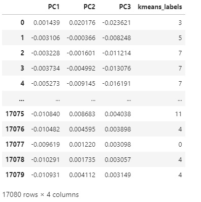
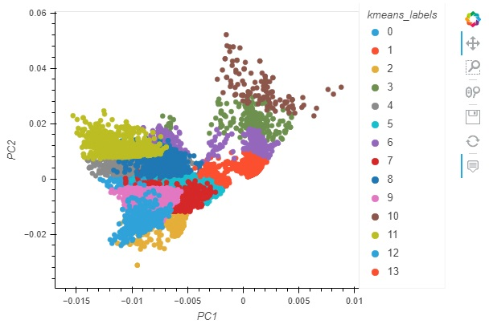
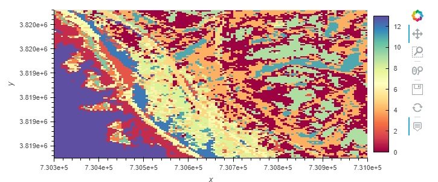
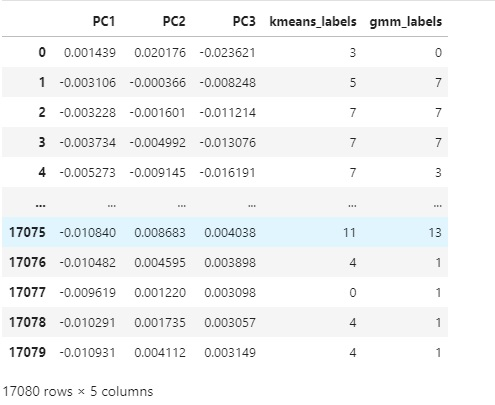
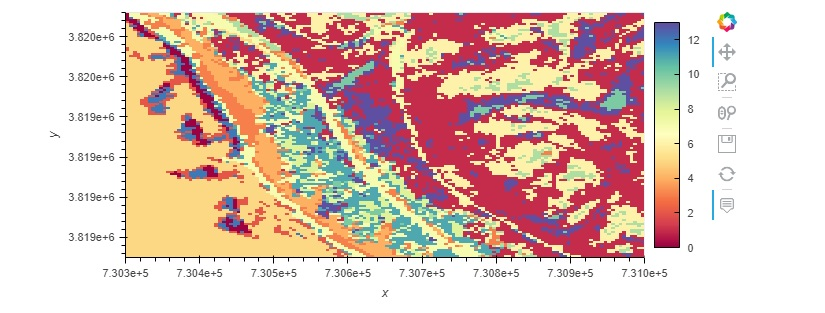

Clustering Example
==================

This notebooks shows examples of how to perform a PCA and use several common clustering algorithms.

Open an interactive notebook:

#. Sign into the SHIFT SMCE Daskhub and select an instance size in different tab

#. Follow this `link`_

#. Select the "notebook" kernel
    
    .. _link: https://daskhub.shift.mysmce.com/user/joyvan/pasarela/open?url=https://raw.githubusercontent.com/EvanDLang/SHIFT-SMCE-User-Guide/development/docs/source/notebooks/clustering_examples.ipynb

::

    import xarray as xr
    import pandas as pd
    from sklearn.decomposition import PCA
    from sklearn.cluster import KMeans
    from sklearn.mixture import GaussianMixture
    import holoviews as hv
    hv.extension('bokeh')
    import hvplot.pandas 
    pd.options.plotting.backend = 'holoviews'
    import hvplot.xarray
    
Pre-processing
--------------

::

    # Read in the data
    ds = xr.open_dataset("reference://", engine="zarr", backend_kwargs={
        "consolidated": False,
        "storage_options": {"fo": "s3://dh-shift-curated/aviris/v1/gridded/zarr.json"}
    })

    # Subset the data using the select method
    aoi = ds.sel(x=slice(730300,731000), y=slice(3819660,3819050), time="2022-03-08")
    aoi

.. image:: ../images/data_visualization/xarray_data.jpg

::

    # Filter out water absorbtion and other bad bands
    badbands_file = '/efs/edlang1/AVIRIS_badbands.csv'
    # Read in csv using Pandas and convert dataframe to a 1D numpy array
    bands = pd.read_csv(badbands_file, sep = ",",header=None).to_numpy().squeeze()
    # Combine the y and x dimensions and use the band bands mask to filter
    data = aoi.stack(combined=('y', 'x')).reflectance[bands==0].T
    df = pd.DataFrame(data, columns=aoi.wavelength[bands==0]).T
    df

PCA
---

::

    # Perform the PCA and convert the results to a dataframe
    pca = PCA(n_components=3).fit(df)
    pca_df = pd.DataFrame(pca.components_.T, columns=['PC1', 'PC2', 'PC3'])
    pca_df

Kmeans
------

::

    # Perform K means with 14 clusters
    kmeans = KMeans(n_clusters=14, init = 'k-means++', random_state=42)
    kmeans = kmeans.fit(pca_df)
    # Add the labels to the dataframe
    pca_df['kmeans_labels'] = kmeans.labels_
    pca_df

::
  
    # Use the hvplot pandas extension to create a scatter plot
    points = pca_df.hvplot.scatter(x='PC1', y='PC2', by='kmeans_labels', 
                     height=400, width=600, cmap='spectral')
    points

::

    # Create a Map using the Kmeans labels and the coordinates from the original xarray dataset

    # Pull x and y values
    y = aoi['y'].values
    x = aoi['x'].values

    # Create new rgb xarray data array.
    data_vars = {'kmeans_labels':(['y','x'], kmeans.labels_.reshape(aoi.dims['y'], aoi.dims['x']))} 
    coords = {'y':(['y'], y), 'x':(['x'], x)}
    attrs = aoi.attrs
    ds_labels = xr.Dataset(data_vars=data_vars, coords=coords, attrs=attrs)
    ds_labels.coords['x'].attrs = aoi['x'].attrs
    ds_labels.coords['y'].attrs = aoi['y'].attrs
    ds_labels.kmeans_labels.hvplot(cmap='spectral')

Gaussian Mixtures
-----------------

::

    # Fit a GM model with the data
    gmm_model = GaussianMixture(n_components=14)
    gmm_model = gmm_model.fit(pca_df.drop('kmeans_labels', axis=1))

    # Add the predicited labels to the dataframe
    pca_df['gmm_labels'] = gmm_model.predict(pca_df.drop('kmeans_labels', axis=1))
    pca_df

::

    # Use the hvplot pandas extension to create a scatter plot
    points = pca_df.hvplot.scatter(x='PC1', y='PC2', by='gmm_labels', 
                     height=400, width=600, cmap='spectral')
    points

.. image:: ../images/clustering_examples/gmm_scatter.jpg

::
    # Add the labels to our xarray labels dataset and plot the map
    ds_labels = ds_labels.assign({'gmm_labels':(['y','x'],pca_df['gmm_labels'].to_numpy().reshape(aoi.dims['y'], aoi.dims['x']))})
    ds_labels.gmm_labels.hvplot(cmap='spectral')

