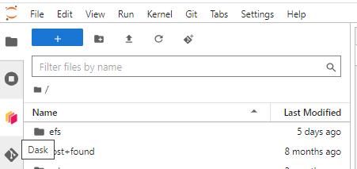
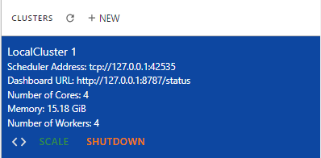
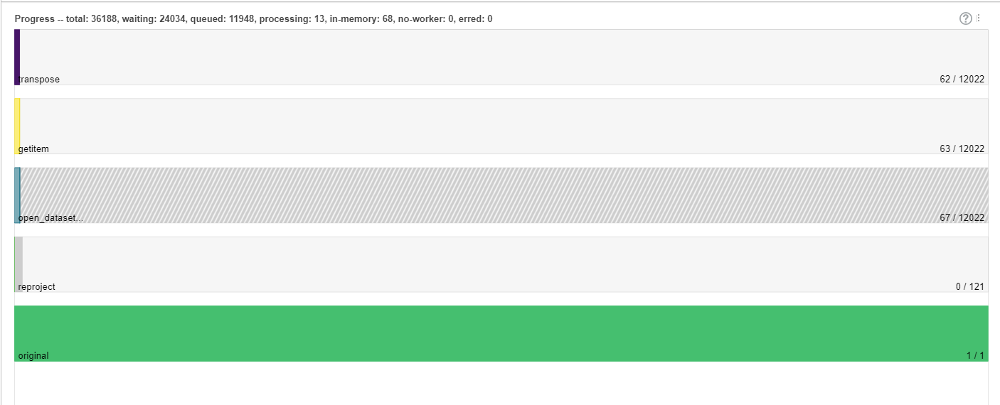
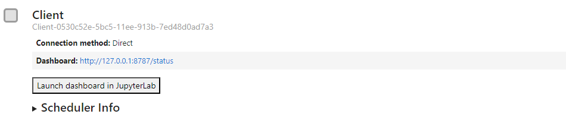
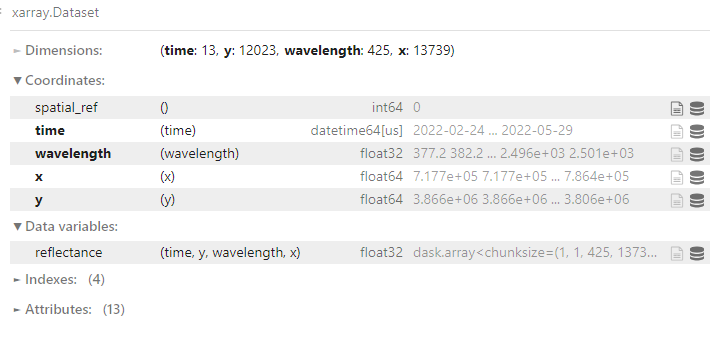
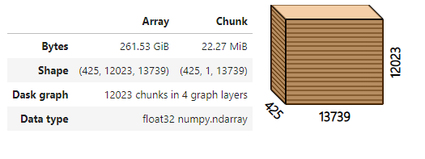
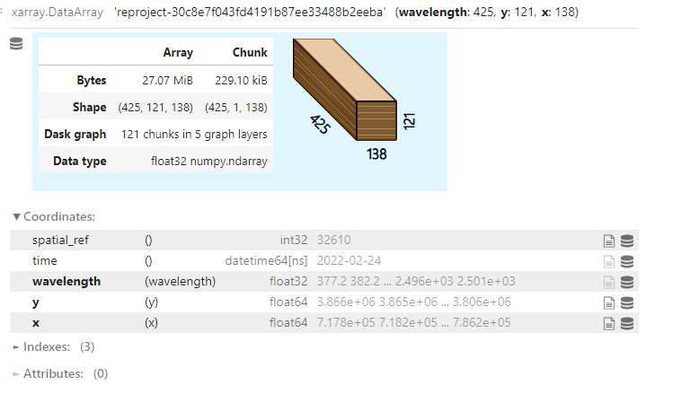
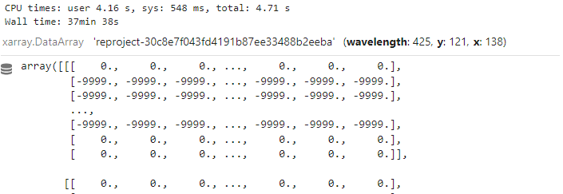

============
Dask Cluster
============

The Python Library Dask is a flexible paralell computing environment. Dask integrates with Jupyter Lab offering a simple user interface for spooling up a local cluster.
This gives the ability to easily utilize a cluster computing environment with less overhead than a traditional cluster. Dask cluster is fully integrated with the Dask library and several other libraries built on top of dask (xarray, rioaxarray).

Intro to Dask
=============
Dask uses something called lazy computations in combination with chunking to allow users to queue multiple operations on large datasets that might be too large for memory. This means computations will not execute until the user specifically calls for it. Once executed the computations are performed in parallel where chunks are loaded into memory and then removed when no longer needed. This is a powerful concept when working with large datasets like SHIFT. When calling compute is important to remember the **final result of the computaions will be pulled into memory**. If it is too large then your kernel will crash. For more information on Dask  `read the documentation here <https://docs.dask.org/en/stable/>`_.

Starting up a Dask Cluster
==========================

* Select on the Dask Icon located on the sidebar near the git icon

* Click on the new option to start up a cluster

* Select the number of workers for your cluster. When choosing this you want to be aware of how many cores are available. This depends on the server size you selected when starting up the Daskhub.
The number of cores is equal to 2 times the number of CPUs available. You should set your worker count to no more than 1 minus the number of avilable cores. For example, if I selected the largest server with 4 CPUS I should not use more than 6 or 7 workers.

* You can use the "<>" icon to inject the code needed to use the cluster directly into your Jupyter notebook.

Monitoring your Cluster
=======================

The Dask Jupyter Lab extensions has a user interface that allows you to monitor all aspects of your local cluster. After clicking on the Dask tab and starting up a cluster There will be many monitoring options to select from. You can monitor memory, cpu usage, and scheduling. I find the progress tab to be the most useful as it shows exactly what the cluster is working on and gives you a sense of how long the task will take.

Example Use Case
=================

::

    import sys
    import subprocess
    sys.path.append('/efs/SHIFT-Python-Utilities/')
    from shift_python_utilities.intake_shift import shift_catalog

    import numpy as np
    import rioxarray as rxr
    import xarray as xr
    import rasterio as rio

    import odc.geo.xr
    if odc.geo.__version__ != '0.4.1':
        subprocess.check_call([sys.executable, '-m', 'pip', 'install', 'odc-geo==0.4.1'])

::

    from dask.distributed import Client

    client = Client("tcp://127.0.0.1:33635")
    client

The first operation is opening the dataset. Since the SHIFT data is too large for memory, Dask in combination with xarray and rioxarray open a virtual representation.

::

    cat = shift_catalog()
    ds = cat.aviris_v1_gridded.read_chunked()
    ds.rio.write_crs(rio.CRS.from_wkt(",".join(ds.attrs['coordinate system string'])), inplace=True)
    ds

My next operation is to reorder the dimensions to make them compatible with my reprojection function. Here I lazily transpose the data.

::

    sub = ds.isel(time=0).reflectance.transpose('wavelength', 'y', 'x')
    sub.data
    

Next, I use ODC Geobox to lazily reproject my data from 5 meter resolution to 500 meter.

::

    how = sub.odc.output_geobox(32610, resolution=(500))
    sub = sub.odc.reproject(how=how, resampling='nearest')
    sub

Now that I have queued up all my operations, Dask has created a task graph of all my lazy computations. I can now trigger the computation using compute. Dask will now operate on each chunk performing the following tasks:

retrieve chunks -> transpose chunks -> reproject chunks

::

    sub.compute()
    

Limitations
===========

Using a local cluster increase computation speed and allow you to utilize additional memory. However, working with the local cluster will not be appropriate for every computing task.

Tasks which are well suited for cluster computing are tasks which can easily segmented into independent subprocesses. Additonally, the end result must fit into memory, so reduction tasks are ideal when dealing with limited memory.

