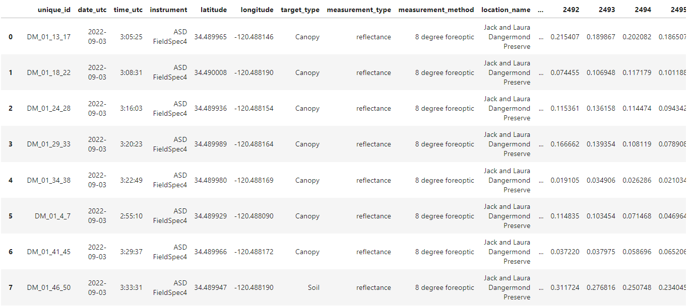
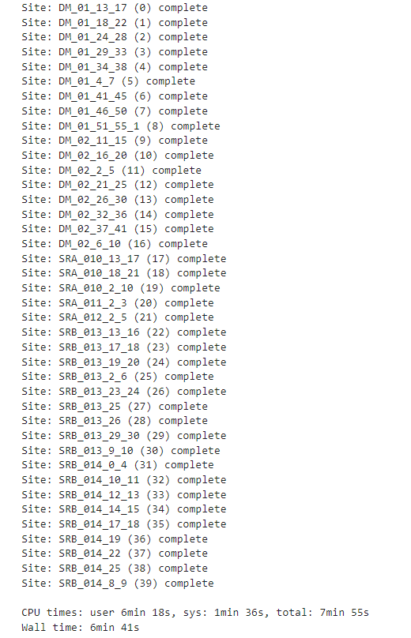
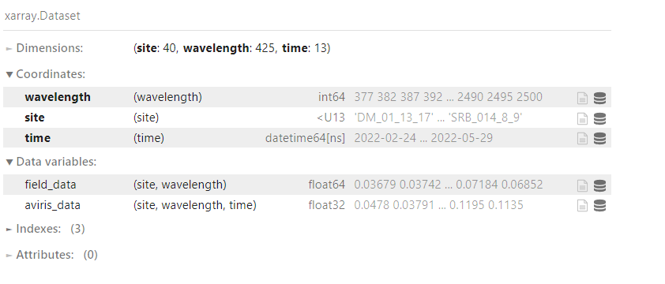
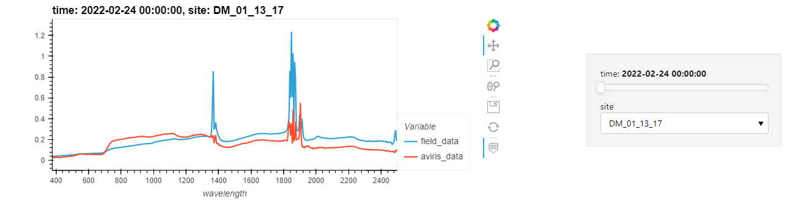

Aligning Field and SHIFT Data
=============================

::

   import pandas as pd
    import geopandas as gdp
    import rioxarray as rxr
    import xarray as xr
    import rasterio as rio
    import numpy as np
    import sys
    sys.path.append('/efs/SHIFT-Python-Utilities/')
    from shift_python_utilities.intake_shift import shift_catalog
    from joblib import Parallel, delayed
    import holoviews as hv
    hv.extension('bokeh')
    import hvplot.xarray

    cat = shift_catalog()

* Read in our field data csv using Pandas
* Convert the dataframe to a Geopandas dataframe using the latitudes and longitudes
* Remove sites missing lattitudes and longitudes
* Filter sites by target type. For this dataset we are only interested in the soil and canopy targets

::

    df = pd.read_csv('/efs/edlang1/FieldData_yangello_DAAC.csv')

    gdf = gdp.GeoDataFrame(
        df, geometry=gdp.points_from_xy(df.longitude, df.latitude), crs="EPSG:4326"
    )

    # Filter out sites missing lat/lon values
    gdf = gdf[~np.isnan(np.asarray(gdf.latitude))].reset_index(drop=True)

    # Filter by target type 
    gdf = gdf[(gdf.target_type == 'Canopy') | (gdf.target_type == "Soil")].reset_index(drop=True)
    gdf

Georeference our SHIFT data

::

    ds = cat.aviris_v1_gridded().read_chunked()
    ds.rio.write_crs(rio.CRS.from_wkt(",".join(ds.attrs['coordinate system string'])), inplace=True)
    ds.rio.crs

Our field sites are 30 by 30 meter grids:

* Convert the geodataframe's CRS to UTM so it is meter based instead of degrees.
* Using Shapely, create a 15 meter square (cap_style of 3) buffer around our field sites.

::

    gdf = gdf.to_crs(gdf.estimate_utm_crs())
    # create a 30 by 30 square around each point
    for i in range(len(gdf)):
        gdf.loc[i, 'geometry'] = gdf.iloc[i].geometry.buffer(15, cap_style=3)

The SHIFT data is sample in 5nm increments while our field data is sampled at 1nm increments. To align the datasets we will use our SHIFT wavelengths to filter our geodataframe.

::

    field_data_df = gdf.filter(ds.wavelength.astype(int).astype(str).values)
    
    
Next, we are going to loop through our field sites:

* Clip our dataset using our buffer polygon.
* Reproject the clipped data area down to a single reflectance value.

Clipping and reprojecting each clipped area for every time is computationally intensive. We can parallelize the the reprojection process to increase the speed.

::

    %%time

    field_data = []
    aviris_data = []
    for ind, row in gdf.iterrows():

        field_area = ds.rio.clip([row.geometry], all_touched=False)

        def reproj(i):
            return field_area.reflectance.isel(time=i).transpose('wavelength', 'y', 'x').rio.reproject(field_area.rio.crs, shape=(1,1))

        temp = Parallel(n_jobs=4, prefer="threads")(delayed(reproj)(i) for i in range(field_area.time.__len__()))

        temp = xr.concat(temp, dim='time').to_dataset().squeeze().reflectance.values.T[None, ...]
        aviris_data += [temp]

        field_data += [np.asarray(field_data_df.iloc[ind])[...,None].T]

        print(f"Site: {row.unique_id} ({ind}) complete")

    print()    
    field_data = np.concatenate(field_data, axis=0)
    aviris_data = np.concatenate(aviris_data, axis=0)

Once we have our data we can use the numpy arrays to create an xarray dataset.

::

    coords = {'wavelength':(['wavelength'], ds.wavelength.values.astype(int)), 'site':(['site'], list(gdf.unique_id)), 'time':(ds['time'].values)}
    data_vars = {'field_data':(['site', 'wavelength'], field_data), 'aviris_data':(['site', 'wavelength', 'time'], aviris_data)}

    out_ds = xr.Dataset(data_vars=data_vars, coords=coords)
    out_ds

Using the hvplot xarray extension we can plot the field and AVIRIS refelectance for each site and observe how the AVIRIS data compares to the field data at each recording date.

::

    out_ds.hvplot(x='wavelength').opts(xticks=10)

