Loading SHIFT Data with Intake
==============================

The SHIFT Python Utilities library has a custom intake driver which provides a simple interface for reading in SHIFT data.  The custom driver allows for common preprocessing operations such as orthorectifying and subseting with a bounding box or shapefile.

This notebook demonstrates some of the basic xarray functionality.

Open an interactive notebook:

1. Sign into the SHIFT SMCE Daskhub and select an instance size in a different tab

2. Follow this `link <https://daskhub.shift.mysmce.com/user/joyvan/pasarela/open?url=https://raw.githubusercontent.com/EvanDLang/SHIFT-SMCE-User-Guide/development/docs/source/notebooks/intake_catalog_demo.ipynb>`_

3. Select a kernel

::
    
    import math
    import numpy as np
    import matplotlib.pyplot as plt
    import xarray as xr
    import pandas as pd
    import os
    os.environ['USE_PYGEOS'] = '0'
    import geopandas as gpd
    import hvplot.pandas 
    import sys
    sys.path.append('/efs/SHIFT-Python-Utilities/')
    from shift_python_utilities.intake_shift import shift_catalog
    import holoviews as hv
    hv.extension('bokeh')
    import hvplot.xarray
    from sklearn.decomposition import PCA
    from sklearn.cluster import KMeans
    import warnings
    warnings.filterwarnings("ignore")

::

    # Supporting Functions
    def gamma_adjust(array):
        # Rescale Values using gamma to adjust brightness
        gamma = math.log(0.2)/math.log(np.nanmean(array)) # Create exponent for gamma scaling - can be adjusted by changing 0.2 
        scaled = np.power(array,gamma).clip(0,1) # Apply scaling and clip to 0-1 range
        scaled = np.nan_to_num(scaled, nan = 1) #Assign NA's to 1 so they appear white in plots
        return scaled

    def generate_rgb_plot(ds):
        # Retreive red, green and blue wavelengths and convert them to numpy arrays
        red = ds.sel(wavelength=650, method="nearest").reflectance
        green = ds.sel(wavelength=560, method="nearest").reflectance
        blue = ds.sel(wavelength=470, method="nearest").reflectance

        # Scale the Bands
        r = gamma_adjust(red)
        g = gamma_adjust(green)
        b = gamma_adjust(blue)

        # Stack Bands and make an index
        rgb = np.stack([r,g,b])
        bds = np.array([0,1,2])

        rgb.shape
        # Pull x and y values
        y = ds['lat'].values
        x = ds['lon'].values
        y.shape
        x.shape
        rgb.shape
        # Create new rgb xarray data array.
        data_vars = {'RGB':(['wavelength', 'lat', 'lon'], rgb)} 
        coords = {'wavelength':(['wavelength'],bds), 'lat':(['lat'],y), 'lon':(['lon'],x)}
        attrs = ds.attrs
        ds_rgb = xr.Dataset(data_vars=data_vars, coords=coords, attrs=attrs)
        ds_rgb.coords['lon'].attrs = ds['lon'].attrs
        ds_rgb.coords['lat'].attrs = ds['lat'].attrs

        return ds_rgb

::
    
    # Open the data catalog
    cat = shift_catalog()
    # List available datasets
    cat.datasets
    
['aviris_v1_gridded', 'L2a', 'L1']

::
    
    # List child datasets
    cat.L1.datasets
    
['glt', 'igm', 'obs', 'rdn']

Reading in Data
---------------

Data can be read in using two function calls: read and read_chunked. The read method will pull all the data in the dataset into memory. It is highly recommended to use the read_chunked method unless you are sure your data can fit into memory.

::

    data = cat.aviris_v1_gridded.read_chunked()
    data
    
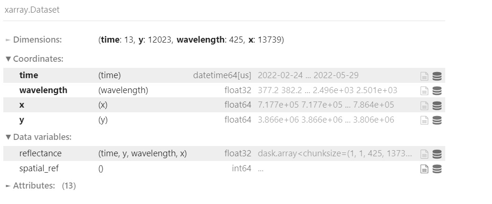

Working with L1 and L2a Data
----------------------------

The L1 and L2a data products can be accessed via the catalog. To load a specific file, use date and the time of the flight. A list of possible dates and times can be retrieved using the following code. The data is located /efs/efs-data-curated. In addition to date and time there are several other arguments you can use to preprocess the data.

Optional Arguments:

- ortho (bool, default: False): If set to True, the associated GLT file will be used to orthorectify the dataset. **Warning orthorectification is a very memory intensive process and depending on the size of the file the Daskhub may not have enough memory to complete the task. In this case you can use the SHIFT cluster or use the subsetting argument to orthorecticy a section of the dataset**

- filter_bands (bool, default: False)(np.ndarray or list): For this argument you can pass a boolean and it will use a set mask to filter out bands. Additionally, if you would like to use a custom mask, you can pass an array or list with the indicies of bands you would like filtered.
    
    
    Here is a list of the default filtered bands:

        [1, 2, 3, 194, 195, 196, 197, 198, 199, 200, 201, 202, 203, 204, 205, 206, 207, 208, 209, 210, 211, 212, 213, 214, 215, 216, 217, 286, 287, 288, 289, 290, 291, 292, 293, 294, 295, 296, 297, 298, 299, 300, 301, 302, 303, 304, 305, 306, 307, 308, 309, 310, 311, 312, 313, 314, 315, 316, 317, 318, 319, 320, 321, 322, 323, 324, 325, 326, 327, 328, 329, 330, 331, 332, 333, 334, 335, 415, 416, 417, 418, 419, 420, 421, 422, 423, 424, 425]

- subset (dict, GeoDataFrame, default: None): This argument allows you to subset the dataset by index(x, and y), latitude and longitude, or with a shapefile formatted as a GeoPandas Dataframe. If using a shapefile, the ortho argument must be set to True.

- chunks (dict, default: {'y': 1}): This argument controls how dask chunks up your array. I recommend using the default of chunking along the y dimension however, depending on what your computing, chunking differently my increase the performance.

::

    # List the available dates
    cat.dates
    
['20220224', '20220228', '20220308', '20220316', '20220318', '20220322', '20220405', '20220412', '20220420', '20220429', '20220503','20220511','20220512', '20220517', '20220529', '20220914', '20220915']
 
::

    # Use a date to get the available times
    cat.times["20220228"]

['183924', '185150', '185720', '190702', '192104', '193333', '194708', '195958', '201833', '202944', '204228', '205624', '210940', '212724', '214527', '215349']
 
 
::

    # Use a date and a time to retrieve the L2a file
    cat.L2a(date="20220228", time="183924").read_chunked()

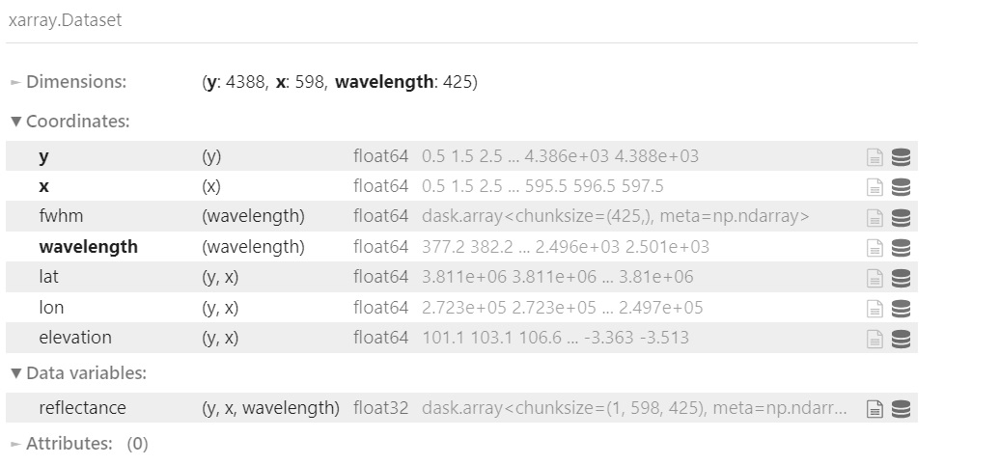

::

    # Use a date and a time to retrieve the radiance file
    cat.L1.rdn(date="20220228", time="183924").read_chunked()

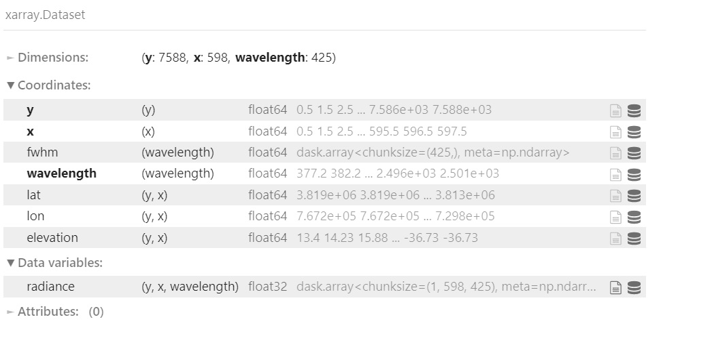

Orthorectifying a Dataset
-------------------------

Using the GLT file
^^^^^^^^^^^^^^^^^^

In order to orthorectify a dataset using the GLT file, all you need to do is set the ortho argument to True.

::

    ds = cat.L2a(date="20220228", time="183924", ortho=True, filter_bands=False).read_chunked()
    ds

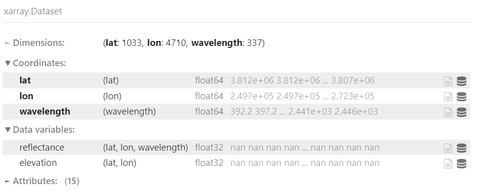

Now that the data is orthorectified we can plot an RGB image of the scene.

::

    ds_rgb = generate_rgb_plot(ds)
    rgb_image = ds_rgb.hvplot.rgb(x='lon', y='lat', bands='wavelength', aspect = 'equal', frame_width=600).opts(tools=["hover"])
    rgb_image

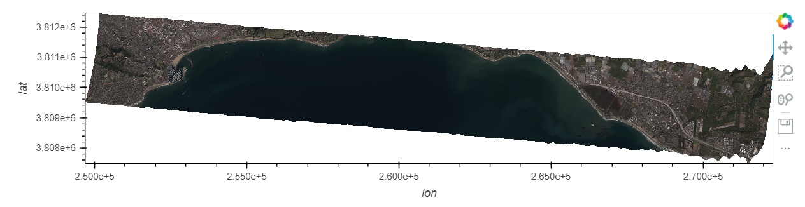

Orthorectifying a Subset of a File
^^^^^^^^^^^^^^^^^^^^^^^^^^^^^^^^^^

Many of the SHIFT reflectance and radiance files are too large to orthorectify the entire scene. Using the subset argument a portion of the scene can be selected and orthorectified. As described above the subset argument can be used with:
    
    - x and y indicies
    
    - lat and lon values (using the correct CRS)
    
    - A shapefile formated as a GeoPandas dataframe (using the correct CRS)

Orthorectifying using x and y indicies

::

    ds = cat.L2a(date="20220228", time="183924", ortho=True, filter_bands=True, subset={'x':slice(29, 200), 'y':slice(34, 500)}).read_chunked()
    ds

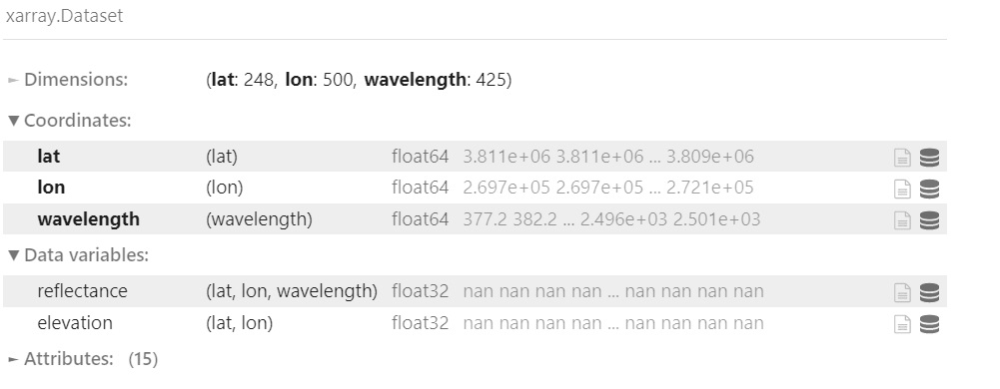

::

    ds_rgb = generate_rgb_plot(ds)
    rgb_image = ds_rgb.hvplot.rgb(x='lon', y='lat', bands='wavelength', aspect = 'equal', frame_width=600).opts(tools=["hover"])
    rgb_image
    
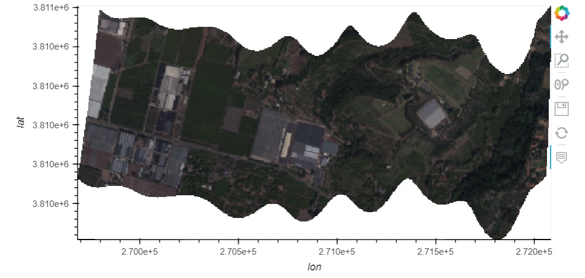

Orthorectifying using lat and lon

::
    
    eastings = np.array([228610.68861488, 237298.11871802])
    northings = np.array([3812959.0852389 , 3810526.08057343])
    ds = cat.L2a(date=20220224, time=200332, ortho=True, filter_bands=True, subset={'lat':northings, "lon": eastings}).read_chunked()
    ds

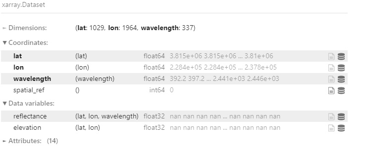

::

    ds_rgb = generate_rgb_plot(ds)
    rgb_image = ds_rgb.hvplot.rgb(x='lon', y='lat', bands='wavelength', aspect = 'equal', frame_width=600).opts(tools=["hover"])
    rgb_image

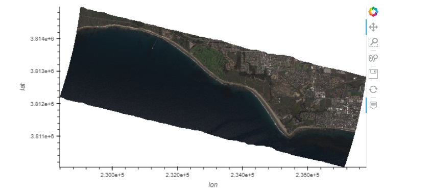

Orthorectifying using a shapefile

::
    
    shp = gpd.read_file("~/SHIFT-Python-Utilities/shift_python_utilities/tests/test_data/shp/test.shp")
    ds = cat.L2a(date=20220224, time=200332, ortho=True, filter_bands=True, subset=shp).read_chunked()
    ds

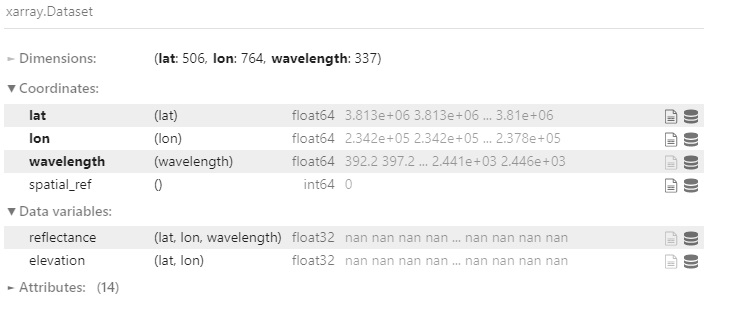

::

    ds_rgb = generate_rgb_plot(ds)
    rgb_image = ds_rgb.hvplot.rgb(x='lon', y='lat', bands='wavelength', aspect = 'equal', frame_width=600).opts(tools=["hover"])
    rgb_image

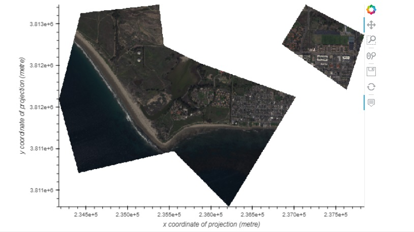

Using the IGM File
^^^^^^^^^^^^^^^^^^

For this section we set the ortho argument to false and use the lat and lon data from the igm file to orthorectify outputs.

::

    # Retrieve a subset of a scene
    ds = cat.L2a(date="20220228", time="183924", ortho=False, filter_bands=True, subset={'x':slice(29, 200), 'y':slice(34, 500)}).read_chunked()
    ds
    
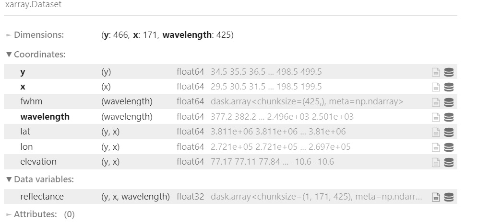

Use the Lat and Lon values to plot an orthorectified elevation map.

::

    # Load the lat, lon and elevation values into memory
    x = ds.lon.values
    y = ds.lat.values
    z = ds.elevation.values
    # Create a contour plot using matplotlib
    fig,ax=plt.subplots(1,1, figsize=(20, 6))
    cp = ax.contourf(x, y, z, levels=15)
    fig.colorbar(cp) # Add a colorbar to a plot
    ax.set_title('Elevation Map')
    plt.show()

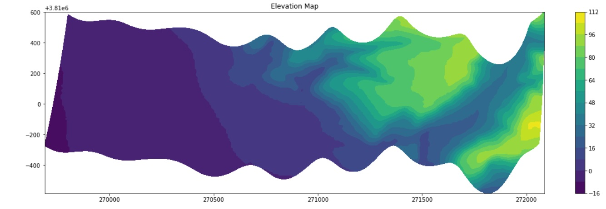

Use the lat and lon values to plot a classification map of the scene.

::

    # Combine the x and y dimension to format data for the PCA
    ds = ds.stack(combined=('x', 'y'))
    pca = PCA(n_components=3).fit(ds.reflectance.values)

    # Perform clustering using the PCA outputs
    kmeans = KMeans(n_clusters=6, init = 'k-means++', random_state=42)
    kmeans = kmeans.fit(pca.components_.T)

    # Add the clustering labels to the dataset as a new variable
    ds = ds.assign({'k_means_labels':(['combined'], kmeans.labels_)})

    # Return the dataset to its original shape by unstacking the x and y dimensions
    ds = ds.unstack('combined')
    ds

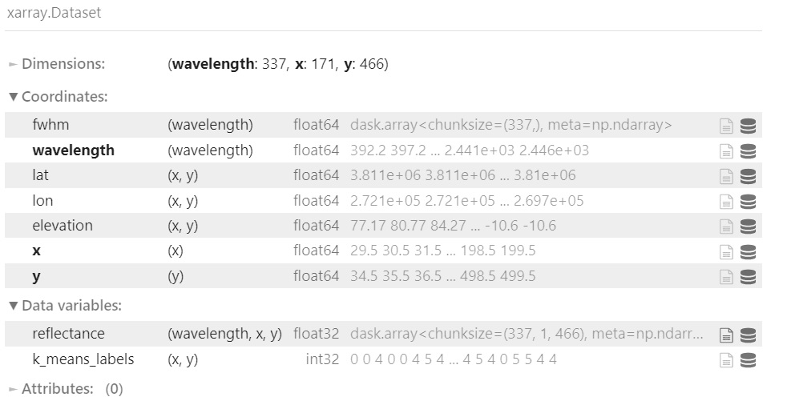

::

    # Use the hvplot quadmesh plot to create the classification map
    classification_map = ds.k_means_labels.hvplot.quadmesh(x='lon', y='lat')
    classification_map

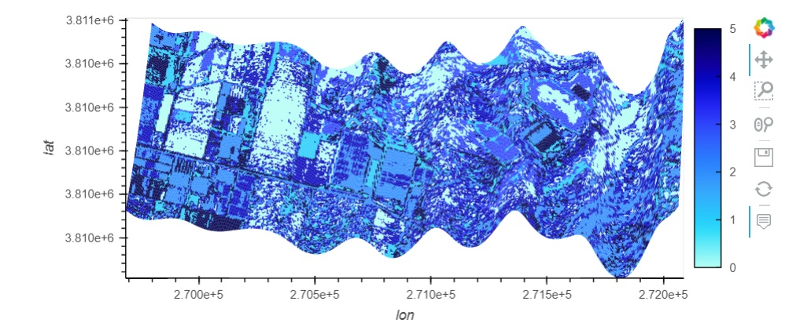