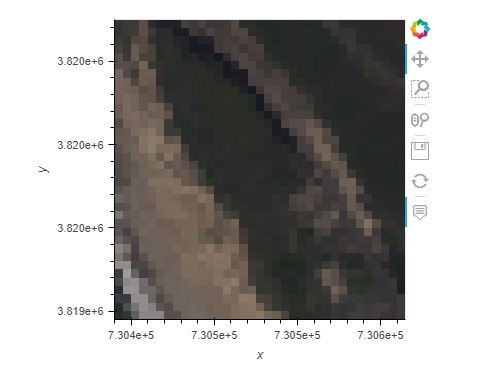

Visualizing Data
================

This notebooks shows examples of how to visualize data using the Holoviews and hvplot libraries with both xarray and pandas. 
Additional information can be found in the `Holoviews`_ user guide.

    .. _Holoviews: https://holoviews.org/user_guide

Open an interactive notebook:

#. Sign into the SHIFT SMCE Daskhub and select an instance size in a different tab

#. Follow this `link`_

#. Select the "notebook" kernel
    
    .. _link: https://daskhub.shift.mysmce.com/user/joyvan/pasarela/open?url=https://raw.githubusercontent.com/EvanDLang/SHIFT-SMCE-User-Guide/development/docs/source/notebooks/visualizing_data.ipynb

::
    
    import sys
    sys.path.append('/efs/SHIFT-Python-Utilities/')
    from shift_python_utilities.intake_shift import shift_catalog
    import xarray as xr
    import rioxarray as rxr
    import math
    import numpy as np
    import holoviews as hv
    from holoviews.plotting.links import DataLink
    from holoviews import opts, streams
    hv.extension('bokeh')
    import pandas as pd
    import hvplot.pandas 
    pd.options.plotting.backend = 'holoviews'
    import hvplot.xarray

Plotting an RGB image
---------------------

Plotting an RGB image can be a good method of validation. Here are some helper functions(normalize_band, brighten, gammacorr) along with a driver (plot_rgb) which can be used for RGB plots

::

    def normalize_band(band):
        mask = ~np.isnan(band)

        band_min, band_max = (band[mask].min(), band[mask].max())
        band[mask] = ((band[mask] - band_min)/((band_max - band_min)))
        return band

    def brighten(band, alpha=0.13, beta=0):
        return np.clip(alpha*band+beta, 0,255)

    def gammacorr(band, gamma=2):
        return np.power(band, 1/gamma)

    def plot_rgb(data, normalize=False, **kwargs):
        """
        accepts 3 bands
        accepted kwargs: alpha, beta, gamma
        """
        assert isinstance(data, xr.DataArray)

        dim_order = data.dims
        assert len(dim_order) == 3, "data must have 3 dimensions (band, y, x)"

        coords = {}
        for dim in dim_order:
            if dim in [data.rio.x_dim, data.rio.y_dim]:
                coords[dim] = getattr(data, dim).values
            else:
                band_dim = dim
                coords[dim] = [0, 1, 2]

        ds_rgb = xr.DataArray(data, dims=dim_order, coords=coords).to_dataset(name='rgb')

        brighten_args = [p for p in inspect.signature(brighten).parameters if p != 'band']
        gamma_args = [p for p in inspect.signature(brighten).parameters if p != 'band']

        b_kwargs = {}
        gamma_kwargs = {}

        for k, v in kwargs.items():
            if k in brighten_args:
                b_kwargs[k] = v 
            elif gamma_args:
                 gamma_kwargs[k] = v

        if normalize:
            ds_rgb = ds_rgb.assign(rgb=(dim_order, 
                      xr.apply_ufunc(normalize_band, ds_rgb.rgb.values, dask='allowed', vectorize=True)))

        if len(b_kwargs) > 0:
            ds_rgb = ds_rgb.assign(rgb=(dim_order, 
                      xr.apply_ufunc(brighten, ds_rgb.rgb.values, *tuple(b_kwargs.values()),  dask='allowed', vectorize=True)))

        if len(gamma_kwargs) > 0:

            ds_rgb = ds_rgb.assign(rgb=(dim_order, 
                      xr.apply_ufunc(gammacorr, ds_rgb.rgb.values, *tuple(gamma_kwargs.values()), dask='allowed', vectorize=True)))

        return ds_rgb, ds_rgb.hvplot.rgb(x=data.rio.x_dim, y=data.rio.y_dim, bands=band_dim, aspect='equal').opts(tools=["hover"])

::

    # Read in the data using the shift python utilities library
    cat = shift_catalog()
    ds = cat.aviris_v1_gridded.read_chunked()

    # Subset the data using the select method
    aoi = ds.sel(x=slice(730300,731000), y=slice(3819660,3819050), time="2022-03-08")
    aoi
    

.. image:: ../images/data_visualization/xarray_data.jpg

::

    ds_rgb, rgb_image = plot_rgb(aoi.reflectance.sel(wavelength=[650, 560, 470], method='nearest'), gamma=1.5)
    rgb_image   

.. image:: ../images/data_visualization/rgb_image.jpg

Using Holoviews with a Pandas Dataframe
----------------------------------------

::

    # Generate some random data
    data = np.random.randn(1000,2 )

    # Create a Pandas Dataframe with the data
    df = pd.DataFrame({'x': data[:, 0], 'y': data[:, 1]})

    # Create a scatterplot with the data, specifying the desired tools
    points = df.hvplot.scatter(x="x", y="y", width=400, height=400).opts(
        tools=["hover", "lasso_select", "box_select"])

    # Create a table from the scatter plot
    table = hv.Table(points)

    # Create a stream
    sel = hv.streams.Selection1D(source=points)

    # Define a function to be used by the stream
    def selected_info(index):
        return hv.Table(points.iloc[index], kdims=['index'], vdims=['x', 'y'])

.. image:: ../images/data_visualization/scatter_plot.jpg

::

    # Access the selected data
    df.iloc[sel.index]

.. image:: ../images/data_visualization/selected_points.jpg

Using Holoviews with Xarray
---------------------------

Selecting a Subset of an Image
^^^^^^^^^^^^^^^^^^^^^^^^^^^^^^

::

    # Create an rgb image with additional opt tools using our previously created rgb data array
    rgb_image = ds_rgb.hvplot.rgb(
        x='x', y='y', bands='wavelength', aspect = 'equal', frame_width=400).opts(
        tools=["hover", 'box_select'])

    # Create our data stream for the box selection
    sel = hv.streams.BoundsXY(source=rgb_image, bounds=(0,0,0,0))

    # Create a function to process the selection
    def selected_info(bounds):
        mask = (
            (ds_rgb.coords["x"] >= bounds[0])
            & (ds_rgb.coords["x"] <= bounds[2])
            & (ds_rgb.coords["y"] >= bounds[1])
            & (ds_rgb.coords["y"] <= bounds[3])
        )

        return xr.where(~mask, 1., ds_rgb['RGB']).transpose('wavelength', 'y', 'x').hvplot.rgb(
            x='x', y='y', bands='wavelength', aspect = 'equal', frame_width=400)

    # Create a dynamic map using the function and stream
    box = hv.DynamicMap(selected_info, streams=[sel]) 
    #Plot both the RGB image and our dynamic map
    (rgb_image + box)

.. image:: ../images/data_visualization/rgb_box_select.jpg

::

    b = box.streams[0].bounds
    ds_rgb.sel(x=slice(b[0], b[2]), y=slice(b[3], b[1])).hvplot.rgb(
        x='x', y='y', bands='wavelength', aspect='equal')
    

Spectra Selection
^^^^^^^^^^^^^^^^^

::

    def find_nearest(array1, array2):
        new_array = np.zeros(array2.shape)
        
        for ind, value in enumerate(array2):
            idx = (np.abs(array1 - value)).argmin()
            new_array[ind] = array1[idx]
        
        return new_array

    # Create an rgb image with additional opt tools using our previously created rgb data array
    rgb_image = ds_rgb.hvplot.rgb(
        x='x', y='y', bands='wavelength', aspect = 'equal', frame_width=400).opts(
        tools=["hover", 'lasso_select'])

    # Create streams
    posxy = hv.streams.PointerXY(source=rgb_image, x=730302.5, y=-3819657.5) 
    sel = hv.streams.Lasso(source=rgb_image, geometry=np.array([[730302.5, 3819657.5]]))

    # Function to build a new spectral plot based on mouse hover positional 
    # Information retrieved from the RGB image using our full reflectance dataset 
    def point_spectra(x,y):
        return aoi.sel(x=x,y=y,method='nearest').hvplot.line(
            y='reflectance',x='wavelength', color='#1b9e77', frame_width=400)

    def selected_info(geometry):
        x = find_nearest(aoi.x, geometry[:, 0])
        y = find_nearest(aoi.y, geometry[:, 1])
        points = set(list(zip(x, y)))

        list_of_lines = [aoi.sel(x=x, y=y, method='nearest').hvplot.line(
            y='reflectance',x='wavelength', frame_width=400) for x, y in points]
        return hv.Overlay(list_of_lines)

    # Define the Dynamic Maps
    point_dmap = hv.DynamicMap(point_spectra, streams=[posxy])
    lasso_dmap = hv.DynamicMap(selected_info, streams=[sel])

    # Plot the RGB image and Dynamic Maps side by side
    (rgb_image + point_dmap*lasso_dmap)

.. image:: ../images/data_visualization/rgb_spectra_select.jpg