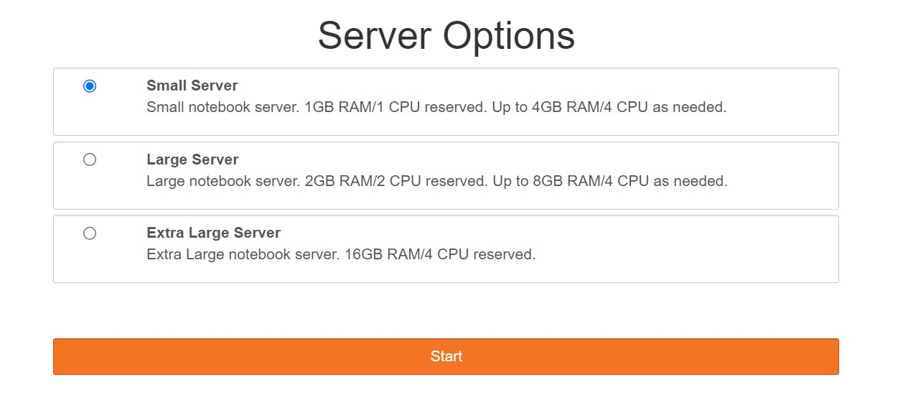

============
Introduction
============

Logging In
==========

1.  You should have received an email with a temporary password.

2.  Navigate to https://daskhub.shift.mysmce.com

3.  Enter your username and temporary password. If this is your first time logging in, you should be prompted to change your password.

4.  If that is successful, you should see a screen like this:

5.  Select the smallest server you need to conduct your work. If in doubt, use the “Small” server; only switch to larger servers if they are necessary. (Larger servers cost more money to run. None of these are that expensive, and they are there for you to use! But be responsible — we don’t want to spend money unnecessarily). When ready, click “Start”. You will see a “Your server is starting up…” page with some status messages. This may take 2-3 minutes to complete, and may include some warnings — please be patient.

Shutting Down Servers and Logging Out
=====================================

When you log into the JupyterLab interface, you are effectively launching a new “virtual machine”. This machine costs money while it runs — not a lot, and, again, it’s there for you to use — but when you aren’t using the machine, especially for long stretches of time (e.g., overnight; over a few days), you should turn it off.

If you close all the browser tabs running the JupyterLab interface, it will turn off automatically after some period of inactivity (15-30 minutes). However, the server will usually stay on if the tab is open in the background.

**It is strongly recommended that, when you are done with JupyterLab, you should shut down the server. To immediately shut down the server:**

    * In the top-right of the Jupyter interface, go to “File → Hub Control Panel”. This will open a new tab.

    * Click the red “Stop my server” button. After a few seconds, you should see the button disappear.

    * If you need to restart the server, hit the “Start my server” button. That will bring up the “Server options” menu described above.

**Note:**

Shutting down an individual JupyterLab server is distinct from logging out of the JupyterHub interface. Shutting down a server does not require you to re-enter your password. Conversely, logging out of the interface will not immediately shut down your running server (if you log out and then log in again within a few minutes, you will return to your currently running server).

To log out of the JupyterHub interface, go to “File → Log out”.

Overview of the JuypterLab Interface
====================================

For a detailed breakdown of the JupyterLab interface, see the JupyterLab documentation. A few highlights:

#. File browser button, in the left sidebar. Click this to bring up the file system browser (2).

#. File browser. This can be used to navigate and modify the file system.

    * A simple way to upload individual files into the file browser is just to drag and drop them into the file browser.

    * Alternatively, you can click the “upload” button (up arrow, two over from the blue “+” in the top left corner).

#. This window is the main “Launcher”. Click the “Python 3” button under the “Notebook” section to launch a Jupyter notebook. If you have multiple Python kernels installed and registered (usually corresponding to different conda environments), you should see several options here. The default kernel corresponds to the `base` conda environment and already includes many Python libraries for data analysis and visualization. Kernels for other languages (R, Julia, Octave) will appear here as well in the future.

    * To open this window, click the blue “+” in the top left corner.

#. Open a terminal window. This is often useful for more advanced file system manipulation tasks that are not possible with the default Jupyter file browser (e.g., anything to do with hidden files).

#. Create a plain text file. By default, this will have a `.txt` extension; however, files can be renamed to have any extension you want, and the JupyterLab text editor should support many formats and programming languages natively for indentation, syntax highlighting, etc. The “create text file and then rename it” is an annoying workaround, but is the main way I’ve figured out for creating and modifying arbitrary text files in this interface.

#. S3 bucket browser. This is not a standard part of the JupyterLab interface. This replaces the file browser with an S3 bucket browser, which looks similar and has similar functionality (can also create files, folders, etc.). When navigating in the file/S3 browser, pay attention to whether you are browsing S3 storage or the file system.

#. List of running kernels. Basically, each Jupyter notebook has its own dedicated process, running a specific version of Python (“kernel”). You can see all currently running kernels here, and turn them off if they are hanging, hogging memory, etc.

    * **NOTE:** Not all currently open notebooks have running kernels, and conversely, some notebooks you don’t currently have open may have running kernels.
