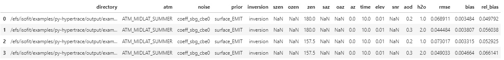
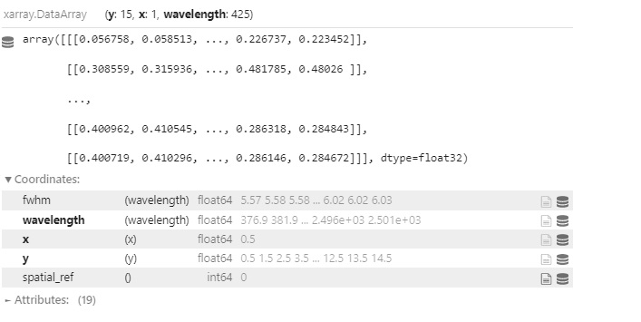

Running Hypertrace on the SMCE
==============================

The SHIFT SMCE cluster provides a powerful computing environment and is ideal for running processes that require more resources than the Daskhub offers.

Getting access to the cluster
-----------------------------

The first step is getting access to the cluster. See the `SHIFT SMCE Parallel Cluster <https://shift-smce-user-guide.readthedocs.io/en/latest/pages/shift_smce_parallel_cluster.html>`_ page.

Installing ISOFIT
-----------------

The first step is to clone the `ISOFIT Github repository <https://github.com/isofit/isofit>`_. Create a directory on EFS, using your username as the directory 
name, and clone the repository there (There is a copy of the repository available on the EFS drive however, I recommend cloning your own copy if you plan on running the examples).
    
Follow the installation instructions in the `ISOFIT documentation <https://isofit.readthedocs.io/en/latest/custom/installation.html>`_. I would recommend :ref:`venv`  and specify the version of Python. The ISOFIT documentation uses Python 3.10, but others versions work (I have it running with Python 3.8).

If you plan on accessing your EFS directory from both the cluster and the Daskhub, you will need to adjust the permissions for the directory you created. **Read the information about directory and file** :ref:`permissions` **if you plan on using EFS storage**.

Running Hypertrace with sRTMnet
-------------------------------

Navigate to the isofit/examples/py-hypertrace directory in the ISOFIT code repo that you cloned earlier.

The 6SV atmospheric radiative transfer model and sRTMnet model emulator have already been downloaded to the EFS drive however, the example data needs to be preprared. Run the following command from the py-hypertrace directory.

::

    ./prepare_hypertrace_data.sh
    
The next step is setting up the configuration file. Example configuration files can be found in the `py-hypertrace/configs directory <https://github.com/isofit/isofit/tree/master/examples/py-hypertrace/configs>`_.
In the example configuration file all of the filepaths are setup relative to the py-hypertrace directory. I recommend using absolute paths as this will simplify things, especially if you plan on running hypertrace from the Daskhub.

Heres is a :download:`config file <../resources/example-srtmnet.json>` setup to run with the paths changed based on the EFS file structure. All you need to do is go in and replace the <username> tag in all the paths with the name of the EFS directory you created earlier.

The SHIFT SMCE cluster uses Slurm to manage computing tasks. See :ref:`slurm` for a brief introduction to Slurm.

Here is an example slurm script that can be used to run hypertrace. Make sure you adjust the out path before running.

::

    #!/bin/bash
    #SBATCH --partition shift-c5n9xlarge-spot
    #SBATCH --job-name py-hypertrace
    #SBATCH --out=/efs/<username>/isofit/examples/py-hypertrace/hypertrace_job-%j.out
    #SBATCH --nodes=1
    #SBATCH --cpus-per-task=12
    #SBATCH --tasks-per-node=1
    #SBATCH --mem-per-cpu=4GB

    source /data/miniconda3/etc/profile.d/conda.sh
    conda activate isofit_env
    python /efs/<username>/isofit/examples/py-hypertrace/workflow.py ${1}
    python /efs/<username>/isofit/examples/py-hypertrace/summarize.py ${1}
    
This command will submit the script to be run on the cluster. The first argument is a path the slurm script above, and the second is a path to the configuration file we created in the previous step.

::

    sbatch <path_to_slurm_script>.sh <path_to_configuration_file>

More detail on running the hypertrace example can be found in the ISOFIT repo `here <https://github.com/isofit/isofit/tree/master/examples/py-hypertrace>`_.

Troubleshooting
---------------

If the slurm job is failing to complete, the outfile should have information about why the failure occured. The following are common issues:

    #. Incorrect file paths
    
    #. Incorrect file types (Input data must be in the ENVI binary format). Here a simple example for converting :download:`NetCDF files to ENVI  <../resources/netcdf_to_envi.py>`.
    
    #. Issues with the ray Python package.
        
        If the error is related to ray failing to start up, I recommend downgrading the verision. Run the following command with your ISOFIT environment activated and it will install ray version 1.2
        
        ::
            
            pip install ray==1.2
    
Running Hypertrace from Daskhub
-------------------------------

Hypertrace slurm jobs can be submitted directly from a terminal on the SHIFT SMCE daskhub via ssh however, there setup steps.

Similar to the previous cluster access guide, you must generate keys. Navigate to your home directory and run the following:

::

    mkdir .ssh
    chmod 700 .ssh
    cd .ssh
    ssh-keygen -t rsa #hit return several times skipping the passphrase prompts

Next your public keys (id_rsa.pub file (your public keys)) must be sent to the SMCE admins and they will grant your Daskhub user access to the cluster.

To open an interactive session you can run:

::

    ssh <user_name>@pcluster.shift.smce.nasa.gov
    
To submit jobs without starting an interactive session use the following:

::

    ssh <user_name>@pcluster.shift.smce.nasa.gov "source /etc/profile;sbatch <path_to_slurm_script>.sh <path_to_configuration_file>"
    
To avoid file permissions issues I would add :code:`umask 0002` to your slurm script.

**Note 1: This will run code from your userhome on the cluster, make sure to adjust all relative paths in your configuration file or use absolute paths.**

**Note 2: If you want to work with the output data on Daskhub make sure you are writting outputs to your EFS directory.**

Working with the Outputs
------------------------

Here is some example code for working with the py-hypertrace outputs.

Read in the outputs from summarize.py

::

    import pandas as pd
    import rioxarray as rxr

    output = "/efs/isofit/examples/py-hypertrace/output/example-srtmnet/summary.csv"

    df = pd.read_csv(output, index_col="Unnamed: 0")
    df

Set file paths to output data

::
    
    atmospheric_coefficients = "/efs/isofit/examples/py-hypertrace/output/example-srtmnet/atm_ATM_MIDLAT_SUMMER__alt_99.90__doy_200__lat_34.150__lon_-118.140/az_0.00__zen_157.50__time_10.00__elev_0.01/noise_noise_coeff_sbg_cbe0/prior_surface_EMIT__inversion_inversion/aod_0.200__h2o_1.000/cal_NONE__draw_0__scale_0/atmospheric-coefficients"
    estimated_reflectance = "/efs/isofit/examples/py-hypertrace/output/example-srtmnet/atm_ATM_MIDLAT_SUMMER__alt_99.90__doy_200__lat_34.150__lon_-118.140/az_0.00__zen_157.50__time_10.00__elev_0.01/noise_noise_coeff_sbg_cbe0/prior_surface_EMIT__inversion_inversion/aod_0.200__h2o_1.000/cal_NONE__draw_0__scale_0/estimated-reflectance"
    estimated_state = "/efs/isofit/examples/py-hypertrace/output/example-srtmnet/atm_ATM_MIDLAT_SUMMER__alt_99.90__doy_200__lat_34.150__lon_-118.140/az_0.00__zen_157.50__time_10.00__elev_0.01/noise_noise_coeff_sbg_cbe0/prior_surface_EMIT__inversion_inversion/aod_0.200__h2o_1.000/cal_NONE__draw_0__scale_0/estimated-state"
    toa_radiance = "/efs/isofit/examples/py-hypertrace/output/example-srtmnet/atm_ATM_MIDLAT_SUMMER__alt_99.90__doy_200__lat_34.150__lon_-118.140/az_0.00__zen_157.50__time_10.00__elev_0.01/noise_noise_coeff_sbg_cbe0/prior_surface_EMIT__inversion_inversion/aod_0.200__h2o_1.000/cal_NONE__draw_0__scale_0/toa-radiance"

Read in estimated reflectance using rioxarray

::

    rxr.open_rasterio(estimated_reflectance).swap_dims({"band":"wavelength"}).drop("band")

