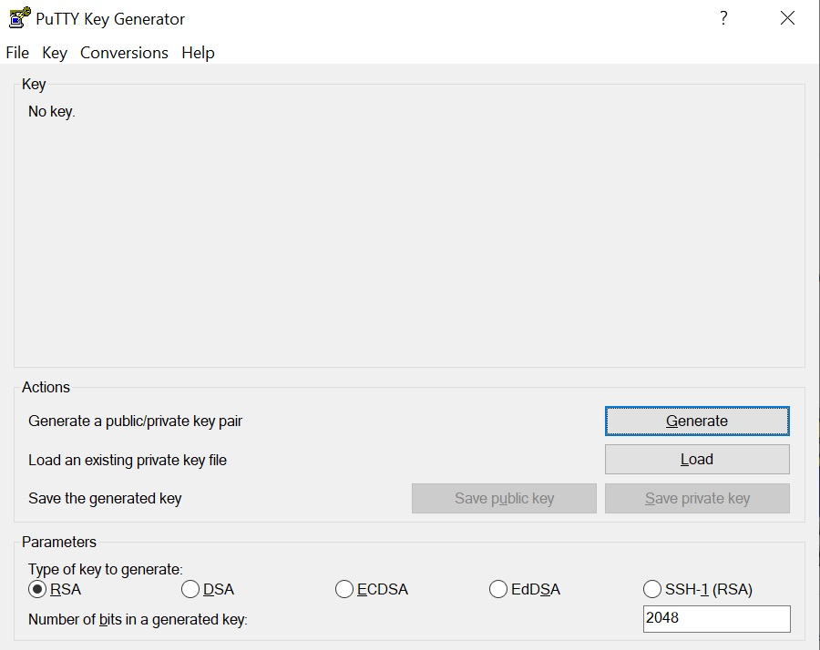
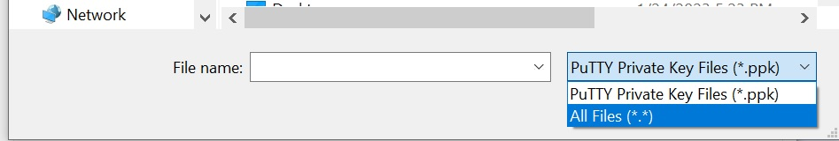
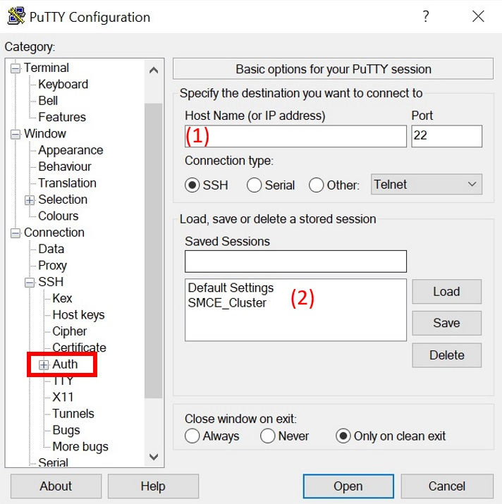
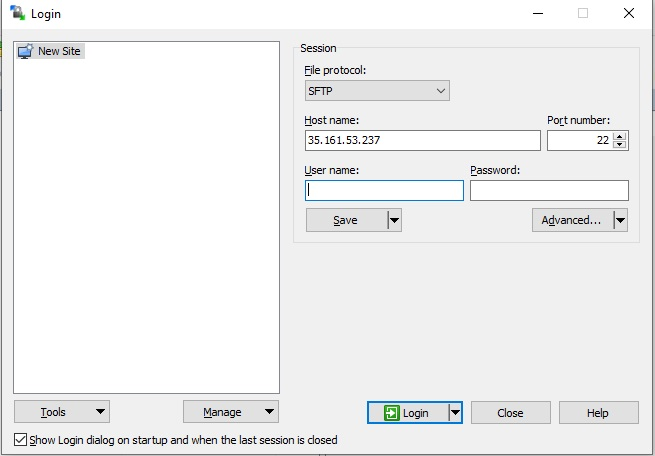
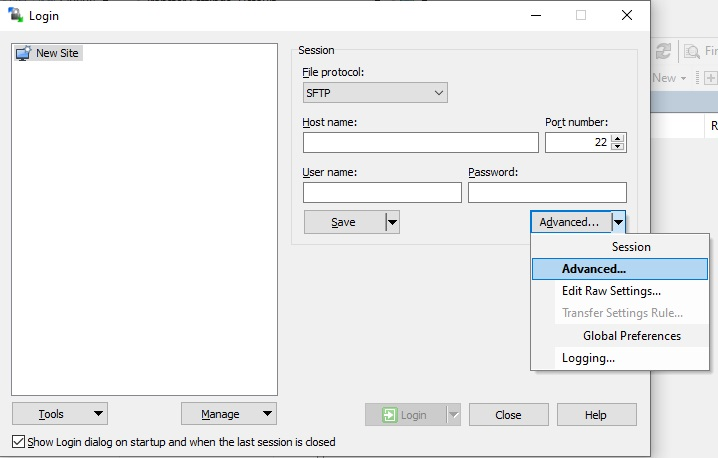
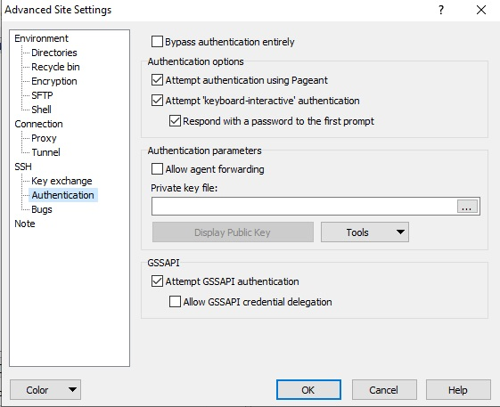

===========================
SHIFT SMCE Parallel Cluster
===========================

Getting Access
==============
In order to get access a request must be submitted to the SMCE admin team after
creating an ssh key pair, reviewing the SMCE training materials, and signing the user agreement

..
    #. Read through the following training documents.

        * :download:`2022 SMCE_Elevated Privileges Security Training <../pdfs/2022_SMCE_Elevated_Privileges_Security_Training.pdf>`

        * :download:`2022 SMCE General Security Training <../pdfs/2022_SMCE_General_Security_Training.pdf>`

    #. Sign the SMCE User Agreement.

        * :download:`2022 SMCE User Agreement <../pdfs/2022_SMCE_User_Agreement.pdf>`
..

1. Open a terminal and create a ssh key pair (public and private) with:

::

    ssh-keygen

2. Email smce-admin@lists.nasa.gov, and attach the public key **NOT PRIVATE** (your public key should have a .pub extension and your private key should be a text file).

3. An administrator will contact you when you have been grated access to the system.

Connecting and Logging In
=========================

Command Line Access (Mac, Linux and Windows)
--------------------------------------------
To access the cluster from the command line open up a fresh terminal and use the following command.

::

    ssh -i <path-to-private-key> <user-name>@35.161.53.237

Putty and WinSCP (Windows only)
-------------------------------

Putty
^^^^^

Putty is an open-source terminal emulator, serial console and network file transfer application that
can be found in the NASA OCIO Software Center.

1. Once Putty has been downloaded, open PuttyGen

|

2. Click load and find your private key .txt file (set the file type to all files)

|

3. Save the private key (do not overwrite your txt file)

4. Open up Putty

|

5. Enter in your user and host name (1) (`username@35.161.53.237`).

6. Using the navigation bar go to SSH and click on Auth.

7. Find the secret key you created with PuttyGen.

8. Return to Session using the navigation bar.

9. Enter a save name in the saved sessions area and click save (2).

10. Click the saved session (2).

11. Click load and then open.

WinSCP
^^^^^^

WinSCP is a popular SFTP and FTB client for Windows and can be used to easily transfer
files from your local machine to the server. WinSCP can be found in the NASA OCIO Software Center.

1. Open WinSCP

|

2. Input host name, user name and port 22, similar to Putty

3. Go to Advanced -> Advanced -> SSH-> Authentication

|

|

4. Load the key you created with PuttyGen and click ok.

5. Save the profile you created (not with password).

6. Select the saved profile and log in.

Storage Options
===============

Home directory
--------------

    Your root directory; full path is `/userhome/your-username`. This is regular file-system storage.
    It is private to your user, but is limited to 75 GB of storage so use this sparingly. This cannot
    be accessed through the SHIFT SMCE Jupyter Lab environment.

EFS
---

    The path is /efs. This is regular file-system storage.
    This is shared across all users, but if you use this, you are strongly recommended
    to create user and/or sub-project-specific subdirectories here to keep things organized.
    This is technically unlimited, but is on a pay-for-what-you-use model, so please use responsibly.
    This can be accessed by both the cluster and the Jupyter Lab environment.

Data
----
    The full path is /data. This is regular file-system storage.
    This is shared across all users, but if you use this, you are strongly recommended
    to create user and/or sub-project-specific subdirectories here to keep things organized.
    The size is 500 GB and things stored here cannot be accessed from the SHIFT SMCE Jupyter
    Lab environment.

Shared
------
    The full path is /shared. This is regular file-system storage.
    This is shared across all users, but if you use this, you are strongly recommended
    to create user and/or sub-project-specific subdirectories here to keep things organized.
    The size is only 50 GB and things stored here cannot be accessed from the SHIFT SMCE Jupyter
    Lab environment.

S3
--
    The S3 buckets are accessible from the compute nodes. See :ref:`s3_buckets` for more details.
    To access the buckets without submitting a Slurm job, you can ssh directly into a node
    using the following commands:

    ::

        # launch an interactive session on a c5n4xlarge spot compute node
        salloc -N 1 -p shift-c5n4xlarge-spot

        # Check the job status every 5 seconds to see when the ST
        # field switches to R indicating that the node is available
        watch -n 5 squeue

        # Ssh into the node via the name provided under the NODELIST column of the
        # squeue output (e.g. shift-c5n4xlarge-spot-dy-c5n4xlarge-1)
        ssh shift-c5n4xlarge-spot-dy-c5n4xlarge-X

        # list available buckets
        aws s3 ls

Managing Environments
=====================

In order to start up a conda environment run the following command.

::

    /data/miniconda3/bin/conda/init

Log out and back in and the Conda base environment will start.

**Note: Make sure to create your own environment and activate it before
downloading any Python packages.**

See :ref:`venv` to create your own Conda environment.

Submitting Jobs
===============

To perform a computing task on the cluster, a shell script is submitted using Slurm.
Slurm is an open source, scalable cluster management and job scheduling
system.

There are several different Slurm queues available for use depending on the resources required for a specific job.
There are two different types of instances (spot vs demand) available with 3 different levels of computing resources.
See :ref:`resource_table`.

Spot instances request unused or spare Amazon EC2 instances at steep discounts and runs whenever capacity is available.
These are good for tasks that are flexible/short and interruptable.

On demand instances are more expensive, but are more suited for tasks that do not have as much flexibility, are longer and cannot be interrupted.

The default instance used is c5n.4xlarge - spot. The sbatch partition argument is used to specify a particular instance type/size (see below).

.. _resource_table:

.. list-table:: Available Instances (Spot or Demand)
   :widths: 30 15 15 15 15
   :header-rows: 1

   * - Instance Name
     - vCPU
     - RAM
     - EBS Bandwidth
     - Network Bandwidth
   * - c5n.4xlarge
     - 16
     - 42 GiB
     - 3.5 Gbps
     - Up to 25 Gbps
   * - c5n.9xlarge
     - 36
     - 96 GiB
     - 7 Gbps
     - 50 Gbps
   * - c5n.18xlarge
     - 72
     - 192 GiB
     - 14 Gbps
     - 100 Gbps

Slurm Shell Script
------------------

The easiest way to submit a job to the Slurm queue is to use a shell script. Below
is an example of a simple script. See :ref:`arg_table` for more details about each argument.

::

    #!/bin/bash
    #SBATCH --nodes 1      # number of nodes
    #SBATCH --partition c5n.9xlarge-spot # partition
    #SBATCH --array=1-10
    #SBATCH --job-name job_name
    #SBATCH --mem=512  # memory in Mb per node
    #SBATCH --output outfile  # send stdout to outfile
    #SBATCH --error errfile  # send stderr to errfile
    #SBATCH --time 0:02:00  # time requested in hour:minute:second

    eval "$(conda shell.bash hook)" # activates conda base environment
    conda activate <your-conda-env> # activates your virtual environment
    python your_script.py ${SLURM_ARRAY_TASK_ID} # runs a python script passing the array id as an argument

.. _arg_table:

.. list-table:: Common SBATCH Arguments
   :widths: 30 70
   :header-rows: 1

   * - Argument
     - Description
   * - \--job-name (-J)
     - Specify a name for the job allocation.
   * - \--output (-o)
     - | Instruct Slurm to connect the batch script's standard output directly
       | to the file name specified in the "filename pattern".
   * - \--error (-e)
     - | Instruct Slurm to connect the batch script's standard error directly
       | to the file name specified in the "filename pattern".
   * - \--nodes (-N)
     - Request that a minimum of minnodes nodes be allocated to this job.
   * - \--partition (-P)
     - | Request a specific partition for the resource allocation. If not
       | specified, the default behavior is to allow the slurm controller to
       | select the default partition as designated by the system administrator.
   * - \--ntasks
     - | sbatch does not launch tasks, it requests an allocation of resources
       | and submits a batch script. This option advises the Slurm controller
       | that job steps run within the allocation will launch a maximum of number
       | tasks and to provide for sufficient resources.
   * - \--cpus-per-task
     - | Advise the Slurm controller that ensuing job steps will require ncpus number
       | of processors per task. Without this option, the controller will just try to
       | allocate one processor per task.
   * - \--mem-per-cpu
     - | Minimum memory required per usable allocated CPU. Default units are
       | megabytes.
   * - \--time
     - Set a limit on the total run time of the job allocation.
   * - \--mail-user
     - | User to receive email notification of state changes as defined by --mail-type.
       | The default value is the submitting user.
   * - \--mail-type
     - | Notify user by email when certain event types occur. Valid type values are NONE,
       | BEGIN, END, FAIL, REQUEUE, ALL. See documentation for a complete list.
   * - \--get-user-env
     - | This option will tell sbatch to retrieve the login environment variables for the user
       | specified in the --uid option.

Once you have your shell script you can submit a job to the cluster.

::

    sbatch your_script.sh

Other helpful commands.

::

    # To view the job queue use the following command
    squeue

    # Get information about the nodes
    sinfo

For additional information on Slurm checkout the `documentation`_!

    .. _documentation: https://slurm.schedmd.com/
