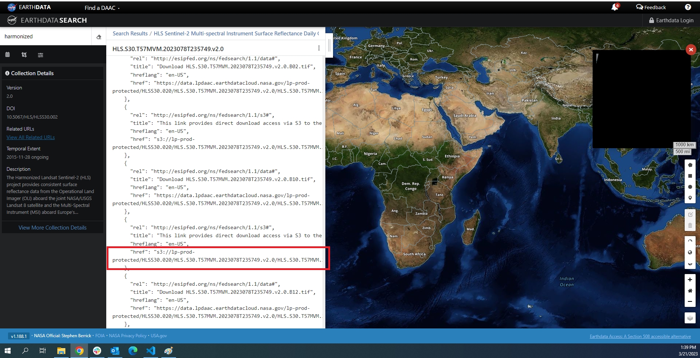

Working With Other Data On SHIFT SMCE
=====================================

EMIT Data
---------

The EMIT team has put together a thorough set of tutorials on how to access and work with the data on `github`_. The easiest way to work with the EMIT data is by using direct s3 access (see the link below).

    .. _github: https://github.com/nasa/EMIT-Data-Resources

- To set up a work environment use the following script to get `direct access the LP DAAC data pool with Python <https://github.com/nasa/EMIT-Data-Resources/blob/main/setup/EarthdataLoginSetup.py>`_. There is no need to setup the emit conda environment as the default conda environment (notebook) should have all the packages required for working with the data.

- `Getting for EMIT data via EarthData search <https://github.com/nasa/EMIT-Data-Resources/blob/main/guides/Getting_EMIT_Data_using_EarthData_Search.md>`_

- `Direct s3 access for EMIT Data <https://github.com/nasa/EMIT-Data::-Resources/blob/main/how-tos/How_to_Direct_S3_Access.ipynbL>`_

- `Extracting an area from EMIT imagery <https://github.com/nasa/EMIT-Data-Resources/blob/main/how-tos/How_to_Extract_Area.ipynbL>`_

Harmonized Landsat Sentinel-2
------------------------------

- Follow the first step under EMIT data to get `direct access the LP DAAC data pool with Python <https://github.com/nasa/EMIT-Data-Resources/blob/main/setup/EarthdataLoginSetup.py>`_.

- Use `EarthData search <https://search.earthdata.nasa.gov/search>`_ to find data.

See :doc:`aligning data with different resolutions <../notebooks/aligning_data_with_different_resolutions>` notebook to see an example of working with EMIT, HLS and SHIFT data.

